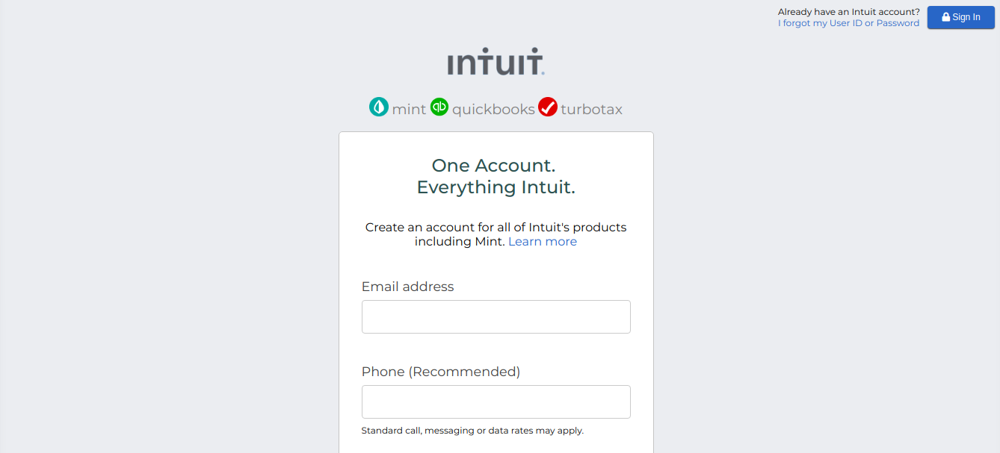
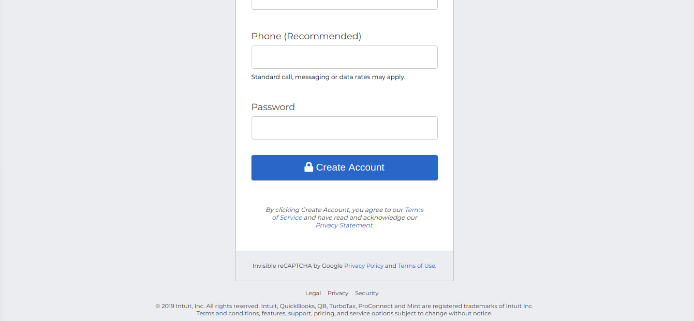

# Project: HTML Forms ([Mint.com’s signup page clone](https://wwws.mint.com/login.event?task=S))

This is the second project of the Main HTML/CSS curriculum at [Microverse](https://www.microverse.org/) - @microverseinc
* The goal was learn about html forms by recreating a Mint.com’s signup page 
* The project was completed using simple html and css 

#### [Assignment link](https://www.theodinproject.com/courses/html5-and-css3/lessons/html-forms)

#### [View in broswer](https://bolah2009.github.io/mint-clone)

#### Live ScreenShot of the page

#### Authors

* [@Torres-ssf](https://github.com/Torres-ssf)
* [@bolah2009](https://github.com/bolah2009/)
